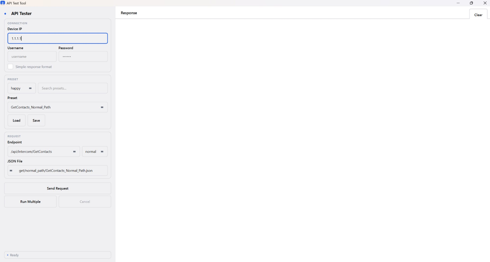

# API Test Tool


## Overview

**API Test Tool** is a desktop QA utility for testing **REST API endpoints** on embedded network devices. Built for internal automation workflows where devices use self-signed certificates and HTTP Digest authentication.

It allows engineers and testers to:

- Send single API requests with live response display
- Execute multiple presets sequentially with progress tracking
- Generate **happy & unhappy test payloads** automatically
- Log all requests and responses to rotating timestamped files

---

## Screenshot



> _Two-panel layout: request configuration sidebar (left) + response viewer (right)_

---

## Features

### API Testing

- Supports **GET / SET / REMOVE** API endpoints
- HTTP Digest authentication
- Async requests via **QThread** — UI stays responsive
- Formatted JSON response display

### Preset System

- Save and load reusable request configurations
- Filter by **test mode** (happy / unhappy) and search text
- Automatic JSON payload binding per preset

### Unhappy Test Generator (`json_generator.py`)

Generates negative test cases across 4 failure categories:

- **No data** — empty / null values
- **Invalid values** — out-of-range or nonsensical inputs
- **Wrong types** — strings where ints expected, etc.
- **Fuzz payloads** — XSS strings, SQL injection, overflow values, unicode

### Logging

- Rotating structured logs (JSON + plain text)
- Separate log file per multi-preset run
- Stored in `logs/` (excluded from version control)

### Architecture

- **Dependency injection** via `DIContainer` with Protocol-based interfaces
- **Mixin composition** — `UIBuilderMixin`, `RequestHandlingMixin`, `PresetHandlingMixin`, `SettingsHandlingMixin`
- **Structured logging** with JSON output and log rotation

---

## Project Structure

```
src/
 ├── main.py                       # Entry point
 │
 ├── [app/]                        # UI layer
 │    ├── __init__.py              # ApiTestApp — mixin composition root
 │    ├── ui_builder.py            # Layout, theme, widget construction
 │    ├── request_handling.py      # Send / cancel requests
 │    ├── preset_handling.py       # Load / save / run presets
 │    ├── settings_handling.py     # Persist and restore UI state
 │    └── dialogs.py               # MultiSelectDialog
 │
 ├── [managers/]                   # Business logic
 │    ├── requests_manager.py      # HTTP worker (QThread) + RequestManager
 │    ├── presets.py               # PresetManager — CRUD + persistence
 │    └── settings.py              # SettingsManager — persistence
 │
 └── [config/]                     # Infrastructure + test data
      ├── constants.py             # Paths, endpoints, theme colours
      ├── di_container.py          # DI container + Protocol interfaces
      ├── logging_system.py        # Structured logger, JSON output, rotation
      ├── json_generator.py        # Generates all happy + unhappy payloads
      └── json_configs/            # Generated JSON files (run json_generator.py once)
```

---

## Installation

### Requirements

- Python **3.10+**
- pip

### Install dependencies

```bash
pip install -r requirements.txt
```

### Run application

```bash
cd src
python main.py
```

---

## Usage

1. Enter **device IP**
2. Select **preset** (or configure endpoint + JSON file manually)
3. Click **Send Request** for a single request
   — or —
   **Run Multiple** to execute a batch of presets sequentially
4. View formatted JSON responses in the right panel
5. Logs saved automatically to `logs/`

---

## Generating Test Payloads

```bash
cd src
python config/json_generator.py
```

Creates the full `json_configs/` folder structure and `presets.json` with all happy and unhappy test cases.

---

## License

MIT License — free to use in internal QA and automation workflows.

---

## Author

**Stanislav Nikolaievskyi**  
[github.com/stasn](https://github.com/stasn)

Developed as a portfolio project demonstrating desktop application architecture with Python and PySide6.
