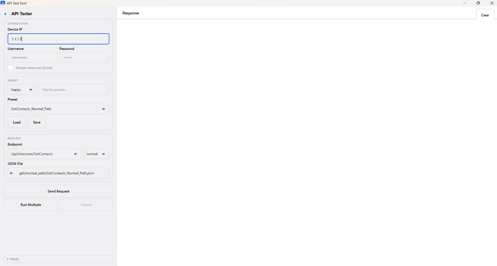

# API Test Tool


Desktop QA utility for sending authenticated HTTP requests to embedded network devices. Supports HTTP Digest auth, batch preset sequences, and per-response logging.



---

## Tech Stack

| Component | Technology |
|:---|:---|
| Language | Python 3.13 |
| UI | PySide6 (Qt 6) |
| Package manager | uv |
| Linter / formatter | ruff |
| Type checker | ty |
| Tests | pytest + pytest-qt + pytest-cov |
| Build backend | hatchling |
| Platforms | Windows (primary), Linux, macOS |

---

## Features

- **Single and batch requests** — send one request or queue a preset sequence
- **HTTP Digest auth** — password stored as `bytearray`, zeroed after use
- **Happy / unhappy test modes** — filter presets by scenario type
- **Live preset search** — cached substring filter across preset names
- **5 payload formats** — Normal Path, Normal Action, Normal Body, Google JSON, JSON-RPC
- **Non-blocking I/O** — HTTP requests run on `QThread` workers, cancellable mid-batch
- **Auto-save** — IP, credentials, window geometry persist between sessions (debounced 500ms)
- **Automatic logging** — plain text + structured JSONL + rotating error file
- **Pretty-print JSON** — responses auto-formatted in the viewer

---

## Quick Start

```bash
git clone https://github.com/Astralborn/API-tester.git
cd API-tester

uv sync --group dev                          # install deps
uv run python src/config/json_generator.py   # generate payloads (first run)
uv run python src/main.py                    # launch
```

---

## Project Structure

```
src/
├── main.py                        # Entry point
├── app/                           # UI layer (mixin composition)
│   ├── __init__.py                # ApiTestApp — combines all mixins
│   ├── ui_builder.py              # Two-panel layout, theme, widget wiring
│   ├── request_handling.py        # Send / cancel / display HTTP responses
│   ├── preset_handling.py         # Load / save / run presets; batch queue
│   ├── settings_handling.py       # Persist and restore UI state
│   └── dialogs.py                 # MultiSelectDialog (batch preset picker)
├── managers/                      # Business logic (no Qt widget imports)
│   ├── requests_manager.py        # RequestWorker (QThread) + RequestManager
│   ├── presets.py                 # PresetManager — CRUD + JSON persistence
│   └── settings.py                # SettingsManager — JSON persistence
└── config/                        # Infrastructure
    ├── constants.py               # Paths, endpoints, theme tokens, TestMode enum
    ├── di_container.py            # DIContainer + Protocol interfaces
    ├── logging_system.py          # StructuredLogger, JsonFormatter, LoggingManager
    ├── json_generator.py          # Generates happy + unhappy test payloads
    └── json_configs/              # Generated payload files (git-ignored)

tests/
├── conftest.py                    # Shared fixtures (QApplication, mock managers)
├── helpers.py                     # Test utilities
├── test_app_widget.py             # ApiTestApp integration tests
├── test_di_container.py           # DIContainer + Protocol structural tests
├── test_dialogs.py                # MultiSelectDialog unit tests
├── test_json_generator.py         # json_generator payload tests
├── test_logging_system.py         # StructuredLogger / formatters tests
├── test_preset_handling.py        # PresetHandlingMixin logic tests
├── test_preset_handling_widget.py # PresetHandlingMixin widget tests
├── test_preset_manager.py         # PresetManager persistence tests
├── test_request_handling.py       # RequestHandlingMixin unit tests
├── test_requests_manager.py       # RequestWorker + RequestManager tests
├── test_settings_handling.py      # SettingsHandlingMixin tests
└── test_settings_manager.py       # SettingsManager persistence tests
```

---

## Generating Test Payloads

Run once before first use, or when endpoints change:

```bash
uv run python src/config/json_generator.py
```

Generates `src/config/json_configs/` and `src/config/presets.json` with every combination of endpoint × format × test type:

| Format | Description |
|:---|:---|
| Normal Path | Method name in the URL path |
| Normal Action | Method as `?action=` query parameter |
| Normal Body | Method name inside the JSON body |
| Google JSON | `apiVersion` + `method` + `params` + `context` envelope |
| JSON-RPC | `jsonrpc` + `method` + `params` + `id` envelope |

Unhappy-path variants: missing fields, invalid values, wrong types, fuzz (XSS, SQL injection, overflow, unicode edge cases).

---

## Supported Endpoints

| Group | Endpoints |
|:---|:---|
| Contacts | `GetContacts`, `SetContacts`, `RemoveContacts` |
| SIP Accounts | `GetSIPAccount`, `GetSIPAccounts`, `SetSIPAccount`, `SetSIPAccounts`, `RemoveSIPAccount`, `RemoveSIPAccounts`, `GetSIPAccountStatus` |
| SIP Configuration | `GetSIPConfiguration`, `SetSIPConfiguration`, `GetSupportedSIPConfigurationAttributes` |
| Audio Codecs | `GetDefaultAudioCodecs`, `GetSupportedAudioCodecs`, `GetAudioCodecs`, `SetAudioCodecs` |
| Call Control | `Call`, `GetCallStatus`, `TerminateCall` |
| Capabilities | `GetServiceCapabilities`, `GetSupportedSIPAccountAttributes`, `GetSupportedMediaEncryptionModes` |

---

## Usage

1. Enter **Device IP**, **Username**, and **Password**
2. Choose **Test mode** (happy / unhappy) — optionally filter with search
3. Select a **Preset** → **Load**, or pick an **Endpoint** + **JSON file** manually
4. **Send Request** for a single call, or **Run Multiple** for a batch
5. Responses appear pretty-printed in the right panel
6. Logs written to `src/logs/`

---

## Logging

Log file per run: `src/logs/log_<preset_name>_<YYYYMMDD_HHMMSS>.log`

Batch runs produce a single combined file with per-preset headers.

Each `StructuredLogger` instance writes three simultaneous streams:

| Stream | File | Min level |
|:---|:---|:---|
| Plain text, rotating | `<name>.log` | DEBUG |
| Structured JSONL, rotating | `<name>_structured.jsonl` | DEBUG |
| Errors only, rotating | `<name>_errors.log` | ERROR |

---

## Testing

```bash
uv run pytest                        # full suite
uv run pytest --cov=src              # with coverage
uv run ruff check src tests          # lint
uv run ruff format --check src tests # format check
uv run ty check src                  # type check
```

| Layer | Scope |
|:---|:---|
| Unit — pure logic | `_preset_matches`, `_validate_ip`, `_format_json_response`, `_escape_html`, filename sanitisation, payload generators |
| Unit — managers | `PresetManager`, `SettingsManager` file I/O; `RequestManager` URL building and log creation |
| Widget | Full `ApiTestApp` with `QApplication` (headless via `pytest-qt`): startup, send/cancel, load/save preset, settings |
| HTTP worker | `RequestWorker.run()` with patched `requests.post` — 200, non-200, network error, timeout, SSL error |
| Infrastructure | `DIContainer`, Protocol satisfaction, `StructuredLogger`, `JsonFormatter`, `ColoredFormatter` |

---

## Architecture

- **Mixin composition** — `ApiTestApp` inherits from four mixins (`UIBuilderMixin`, `RequestHandlingMixin`, `PresetHandlingMixin`, `SettingsHandlingMixin`). Each mixin declares required attributes via a Protocol stub under `TYPE_CHECKING`.
- **DI container** — `DIContainer` wires three managers via structural `Protocol` interfaces for isolated testing.
- **Enums** — `TestMode(StrEnum)` for type-safe mode filtering, compatible with JSON serialisation.
- **Structured logging** — `StructuredLogger` writes three streams per instance (plain text, JSONL, errors-only) with rotating handlers.
- **Memory safety** — passwords stored as `bytearray`, zeroed after the HTTP request.
- **Path safety** — JSON file loading validates paths stay within `JSON_FOLDER` via `.resolve()` + `.relative_to()`. HTML output uses `html.escape()`.
- **CI** — GitHub Actions runs lint, type-check, and test jobs in parallel on push/PR.

---

## Configuration Files

| File | Purpose |
|:---|:---|
| `pyproject.toml` | Project metadata, dependencies, tool config |
| `uv.lock` | Locked dependency versions |
| `src/config/presets.json` | Saved presets (git-ignored, generated) |
| `src/settings.json` | Persisted UI state (git-ignored, created on first run) |

---

## License

MIT

---

## Author

Stanislav Nikolaievskyi · [github.com/Astralborn](https://github.com/Astralborn)
